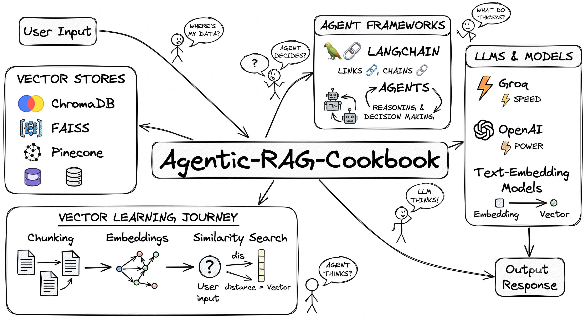

# Agentic-RAG-Cookbook


Agentic-RAG-Cookbook

Welcome to the **Agentic-RAG-Cookbook**, a state-of-the-art educational and development repository focused on **Retrieval-Augmented Generation (RAG)**, **Advanced Semantic Search**, and **Stateful Agentic Orchestration**. 

This workspace—along with the specialized `26_Debugging_OpenAI` package—contains complete, hands-on Python implementations ranging from basic vector databases to complex, self-correcting agent loops (using LangGraph, LangChain, and modern state validation).

<p align="center">
  
</p>

---

## 📖 Table of Contents
1. [Overview & Design Philosophy](#-overview--design-philosophy)
2. [Workspace Architecture & File Map](#-workspace-architecture--file-map)
3. [Vector Databases: Storage & Indexing](#1-vector-databases-storage--indexing)
4. [Advanced Retrieval & Generation Techniques](#2-advanced-retrieval--generation-techniques)
5. [Core LangChain & Pydantic Concepts](#3-core-langchain--pydantic-concepts)
6. [Agents & Stateful Chatbots](#4-agents--stateful-chatbots)
7. [LangGraph: ReAct Loops & Self-Correcting RAG](#5-langgraph-react-loops--self-correcting-rag)
8. [Advanced RAG Orchestrations](#6-advanced-rag-orchestrations)
9. [Isolated Sandbox: 26_Debugging_OpenAI](#7-isolated-sandbox-26_debugging_openai)
10. [Getting Started & Installation](#-getting-started--installation)
11. [Environment Variables Reference](#-environment-variables-reference)

---

## 🌟 Overview & Design Philosophy

The purpose of this repository is to act as a **developer's reference guide and sandbox** for building production-grade LLM applications. Instead of relying on rigid, high-level abstractions, the code demonstrates how things work under the hood. You will find:

*   **Explicit Workflows**: No hidden magic. Each script is self-contained or explicitly parameterized, showcasing exactly how documents are loaded, split, indexed, retrieved, graded, and fed into models.
*   **Dual Orchestration**: Highlights the shift from traditional **LangChain Chains (LCEL)** to highly complex, circular, and cyclic **LangGraph StateGraphs**.
*   **Multi-Provider Design**: Leverages various model providers (OpenAI, Anthropic, HuggingFace, Groq with Qwen, and Ollama) using modern abstractions like LangChain's `init_chat_model` to allow simple runtime model swapping.

---

## 🗂️ Workspace Architecture & File Map

Here is an architectural map of how files in this repository group by educational module:

```
Agentic-RAG-Cookbook/
├── Vector DBs & Indexing (Chroma, FAISS, Astra, Pinecone)
│   ├── 01a_Create_Text_Files.py           # Prepares sample cybersecurity & tech datasets
│   ├── 01a_Embedding_Check.py            # Diagnostic check for OpenAIEmbeddings dimensions
│   ├── 02a_ChromaDB_VectorStore.py       # Creating & persisting vector stores in Chroma
│   ├── 02b_ChromaDB_RAGChain.py          # Classic Stuff Chain RAG over Chroma
│   ├── 02c_ChromaDB_LCEL_NewDoc.py       # Building customizable chains with LangChain LCEL
│   ├── 02d_ChromaDB_ConverseMemory.py    # Conversation chain with memory variables
│   ├── 03a_FAISS_BuildStore.py           # Ingestion and serialization of local documents using FAISS
│   ├── 03b_FAISS_SimilaritySearch.py     # Semantic search, filtering, and scoring using FAISS
│   ├── 03c_FAISS_RAG_Groq_Doc.py         # Combining Groq (Qwen) with FAISS retrieved documents
│   ├── 03d_FAISS_BuildStore_TextFile.py  # Building vector indices from flat datasets
│   ├── 03e_FAISS_RAG_Groq_Text.py        # Complete RAG pipeline query with Groq-based inference
│   ├── 04_InMemoryVectorStore_Sample.py  # Volatile vector store implementations for tests
│   ├── 08_AstraDB_Sample.py              # Cloud-native serverless Cassandra vector search setup
│   └── 09_PineconeDB_Sample.py           # Serverless Pinecone index management and query flow
│
├── Advanced Retrieval (Expansion, HyDE, Re-ranking, MMR)
│   ├── 10b_RAG_CustomChunker.py          # Custom structure-based text-splitters
│   ├── 10d_RAG_NativeChunker.py          # LangChain's RecursiveCharacterTextSplitter patterns
│   ├── 11_DensesParse.py                 # Hybrid dense/sparse text parsing (Ensemble BM25 + FAISS)
│   ├── 12_ReRanking.py                   # Two-stage retrieval using LLMs to re-score candidates
│   ├── 13_MMR.py                         # Maximal Marginal Relevance to resolve document redundancy
│   ├── 14_QueryExpansion.py              # Generating multiple sub-queries to capture synonyms
│   ├── 15_QueryDecomposition.py          # Breaking down nested multi-part user queries
│   ├── 16a_HyDE_Manual_BetterOP.py       # Hypothetical Document Embeddings with customized templates
│   ├── 16b_HyDE_Embed_Web.py             # Integrating HyDE with Wikipedia and Web sources
│   ├── 16c_HyDE_Embed_Custom.py          # Custom prompt schemas to build domain-specific HyDE
│   └── 17_MultimodalOpenAI.py            # Multi-modal (Text + Image/PDF) retrieval and modeling
│
├── Core Abstractions & Schema Modeling
│   ├── 18c_Langchain_Models.py           # Using init_chat_model for decoupled provider setups
│   ├── 18d_Langchain_StreamVSBatch.py    # Direct comparison of stream vs. batch latency characteristics
│   ├── 18e_Langchain_BindTools.py        # Declaring functions as tools and binding to models
│   ├── 18f_Langchain_Message.py          # Custom messaging wrappers (System, Human, AI, Tool)
│   ├── 18g_Langchain_StructuredTypeDict.py# Enforcing typed outputs with TypedDict schemas
│   ├── 18h_Langchain_StructuredPydanticpy# Structuring nested JSON data using Pydantic BaseModel
│   ├── 18i_Langchain_Middlewarepy        # Execution pipelines and runtime middleware interceptors
│   ├── 21a_TypedDict_StateSchema.py      # State modeling using TypedDict schemas
│   ├── 21b_DataClassStateSchema.py       # State modeling using dataclass schemas
│   ├── 21c_Pydantic.py                   # Parsing and data validation with Pydantic
│   └── 21d_Pydantic_StateSchema.py       # Advanced state modeling using Pydantic constraints
│
├── Chatbots, Streaming, & Agents
│   ├── 18a_LangchainAgent_Intro.py       # Basic LLM tool routing agent overview
│   ├── 18b_LangchainAgent_WeatherAPI.py  # Agent calling free geocoding and Open-Meteo APIs
│   ├── 20_Chatbot.py                     # A stateful chatbot built with LangGraph message state
│   ├── 23a_Messages_Tools_Baseline.py    # Mapping complex multi-argument tools to model invocations
│   ├── 23b_State_Graph_Reducers.py       # Custom state graph reducers and list update mechanics
│   └── 25b_Streaming.py                  # Deep-dive into stream_mode ("updates" vs. "values")
│
├── StateGraphs & Prebuilt Agents (LangGraph)
│   ├── 19_SimpleGraph.py                 # Introductory two-node cyclic LangGraph StateGraph
│   ├── 24b_ChatbotsWithMultipletools.py  # LangGraph chatbot bound with a rich suite of local tools
│   ├── 27a_AgentsArch_MathTools.py       # Math tool agents using compiled graphs
│   ├── 27b_AgentsArch_SearchTools.py     # Search and web routing agents using Tavily
│   ├── 27c_AgentsArch_DictTechTools.py   # Specialized dictionary and lookup agents
│   ├── 27d_AgentsArch_AllTools.py.py     # Combined agent containing mathematical, dictionary, and web tools
│   ├── 29a_AgenticRAG1.py                # Initial pipeline combining vector retrieval with agents
│   ├── 31a_ReAct.py                      # Basic prebuilt ReAct framework (Think → Act → Observe)
│   └── 31b_ReAct.py                      # Advanced ReAct utilizing multi-source corporate routing
│
├── Advanced Agentic RAG & Graph Orchestration
│   ├── 31d_AgenticRAGDetailedProject_Grader.py  # Self-correcting RAG flow with custom LLM document grader
│   ├── 31d2_AgenticRAGDetailedProject_Grader.py # Corrective RAG variant implementing prompt improvements
│   ├── 35_COTRag.py                      # Chain-of-Thought RAG breaking queries into steps
│   ├── 36_Selfreflection.py              # Self-Reflection loop to rewrite poor quality answers
│   ├── 37_QueryPlanningDecomposition.py  # Query decomposition nodes compiled in a LangGraph workflow
│   ├── 39_Answersynthesis.py             # Collating and merging multi-source answers into an output
│   ├── 40_Multiagent.py                  # Multi-agent coordination (Supervisor routing to sub-agents)
│   ├── 41_CorrectiveRAG.py               # Full Corrective RAG (CRAG) with web search backup nodes
│   ├── 42_AdaptiveRAG.py                 # Adaptive RAG routing query to specialized stores vs. web search
│   ├── 43_RagMemory.py                   # Dynamic cross-turn RAG memory storing context across sessions
│   ├── 44_CacheAugmentGeneration.py      # Cache-Augmented Generation (CAG) for long-context prompts
│   └── 45_RagEvaluation.py               # RAGAS-style evaluation measuring faithfulness and precision
│
└── 26_Debugging_OpenAI/                 # Isolated workspace for local LangGraph API debugging
```

---

## 🗃️ 1. Vector Databases: Storage & Indexing

Modern RAG relies on storing raw documents as high-dimensional semantic embeddings. This repository contains detailed, production-style examples for 5 separate vector storage engines:

```
                                  ┌────────────────────────┐
                                  │   Raw Documents (.txt)  │
                                  └───────────┬────────────┘
                                              │
                                              ▼  [RecursiveCharacterTextSplitter]
                                  ┌────────────────────────┐
                                  │   Normalized Chunks    │
                                  └───────────┬────────────┘
                                              │
                                              ▼  [OpenAIEmbeddings / HFEmbeddings]
                               ┌──────────────┴──────────────┐
                               ▼                             ▼
                  ┌─────────────────────────┐   ┌─────────────────────────┐
                  │    Local Vector Store   │   │    Cloud Vector Store   │
                  │   (ChromaDB / FAISS)    │   │  (Pinecone / AstraDB)   │
                  └─────────────────────────┘   └─────────────────────────┘
```

### Supported Stores & Implementations
1.  **ChromaDB (`02a_ChromaDB_VectorStore.py`, `02b_ChromaDB_RAGChain.py`)**:
    *   Deploys a local sqlite-backed vector persistent index.
    *   Demonstrates how `DirectoryLoader` reads and transforms folder files using `RecursiveCharacterTextSplitter`.
    *   Utilizes the modern `langchain-chroma` client to perform standard vector additions and persist chunks.
2.  **FAISS (`03a_FAISS_BuildStore.py`, `03b_FAISS_SimilaritySearch.py`)**:
    *   Implements Meta's high-performance **Facebook AI Similarity Search** library (`faiss-cpu`).
    *   Teaches local vector saving (`index.faiss` / `index.pkl`) and loading.
    *   Explains distance-based scoring thresholds, showing how to execute semantic lookups and discard poor results.
3.  **Pinecone (`09_PineconeDB_Sample.py`)**:
    *   Shows integration with a serverless cloud provider.
    *   Demonstrates check-and-create routines for index existence, dimension alignment, and serverless specs (AWS/GCP).
    *   Uses `PineconeVectorStore` from `langchain-pinecone` for cloud-based storage and querying.
4.  **AstraDB (`08_AstraDB_Sample.py`)**:
    *   Integrates DataStax AstraDB (built on Apache Cassandra) using `AstraDBVectorStore`.
    *   Details connection parameters, API endpoints, application tokens, and namespacing setup.
5.  **In-Memory Store (`04_InMemoryVectorStore_Sample.py`)**:
    *   Utilizes a volatile store inside RAM. Highly recommended for rapid unit testing and low-overhead debugging of agent architectures.

---

## ⚡ 2. Advanced Retrieval & Generation Techniques

Simple cosine similarity often retrieves irrelevant information if a user's query is poorly framed. This repository implements several advanced, multi-step search strategies to optimize context precision:

### A. Hybrid Dense/Sparse Retrieval (`11_DensesParse.py`)
Dense semantic search (using vector distance) can sometimes miss exact keyword matches. This sandbox implements **Hybrid Retrieval** using LangChain's `EnsembleRetriever`:
*   **Sparse Retriever**: `BM25Retriever` calculates term-frequency overlaps.
*   **Dense Retriever**: `FAISS` indexes semantic context via neural embeddings.
*   **Reciprocal Rank Fusion (RRF)**: Combines top-ranking hits from both methods into a unified, high-relevance output context list.

### B. Query Expansion (`14_QueryExpansion.py`)
Generates multiple variations of the initial query using an LLM. By retrieving documents for each variation, the system captures synonyms and related technical concepts that may not match the user's literal query:
```
                                ┌────────────────────────┐
                                │   User Query (Short)   │
                                └───────────┬────────────┘
                                            │
                                            ▼  [Prompt Template / LLM]
                                ┌────────────────────────┐
                                │ Query 1  Query 2  ...  │  (Expanded Synonyms)
                                └───────────┬────────────┘
                                            │
                                            ▼  [Vector Store Querying]
                                ┌────────────────────────┐
                                │  Deduplicated Context  │
                                └────────────────────────┘
```

### C. Query Decomposition (`15_QueryDecomposition.py`, `37_QueryPlanningDecomposition.py`)
Deconstructs complex, multi-part questions (e.g., *"What was Company A's Q3 revenue, and how does it compare to Company B's Q3 revenue?"*) into simpler sub-queries. The agent executes these sequentially, routing sub-queries to appropriate data sources, and then synthesizes a unified answer.

### D. HyDE: Hypothetical Document Embeddings (`16a_HyDE_Manual_BetterOP.py`)
Instead of embedding a question, HyDE uses an LLM to generate a "fake" or *hypothetical* answer to that question first. It then embeds this hypothetical document to query the vector store. This bridges the language mismatch between questions and answers, focusing lookups on answer-style semantics:
```
           ┌────────────────┐       [LLM]      ┌───────────────┐
           │   User Query   ├─────────────────>│ Hypothetical  │
           └────────────────┘                  │   Document    │
                                               └───────┬───────┘
                                                       │
                                                       ▼  [OpenAIEmbeddings]
                                               ┌───────────────┐
                                               │ Vector Search │
                                               └───────────────┘
```

### E. LLM-Based Re-ranking (`12_ReRanking.py`)
A two-stage retrieval strategy:
1.  **Stage 1 (Retrieval)**: A fast vector search fetches a broad candidate pool (e.g., K=20 documents).
2.  **Stage 2 (Re-ranking)**: An LLM acts as a high-fidelity cross-encoder, reading the actual query and context candidates side-by-side. It assigns relevance scores and reorders candidates, bringing the absolute most critical context chunks to the very top.

### F. Maximal Marginal Relevance / MMR (`13_MMR.py`)
Balances retrieval relevance with information diversity. Instead of grabbing the $N$ most similar chunks (which are often repetitive copies of the same text), MMR penalizes chunks that overlap heavily with already retrieved content. This maximizes the breadth of retrieved details.

---

## 🧱 3. Core LangChain & Pydantic Concepts

At the foundation of this repository is a rigorous usage of modern LangChain patterns combined with structural schema definitions:

### Decoupled Models via `init_chat_model`
Instead of hardcoding provider classes like `ChatOpenAI` or `ChatAnthropic`, scripts like `18c_Langchain_Models.py` utilize the flexible factory initializer:
```python
from langchain.chat_models import init_chat_model

# Swapping providers at runtime is as simple as updating string parameters
model = init_chat_model("groq:qwen/qwen3-32b", temperature=0)
```

### Streaming Architectures (`25b_Streaming.py`)
The workspace demonstrates two major axes of streaming:
1.  **Execution Engine**: `.stream()` (yields chunked generator outputs) vs. `.astream_events()` (asynchronously streams granular system execution events like tool start, node execution, and raw tokens).
2.  **State Streaming Modes (`stream_mode`)**:
    *   `updates`: Yields only the incremental state modifications generated by the active graph node during its cycle.
    *   `values`: Yields the entire compiled global state array at every turn.

### Tool Binding (`18e_Langchain_BindTools.py`)
Shows how to use LangChain's `@tool` decorator to automatically parse standard Python function docstrings and argument types into JSON schemas, and bind them to chat models using `model.bind_tools()`:
```python
@tool
def calculate_metrics(a: float, b: float) -> float:
    """Computes specialized performance ratios between parameters a and b."""
    return (a / b) * 100

model_with_tools = model.bind_tools([calculate_metrics])
```

### Structured Output & Schemas (`18h_Langchain_StructuredPydanticpy`, `21c_Pydantic.py`)
Ensures model outputs are formatted into clean, nested JSON. By leveraging Pydantic's `BaseModel`, schemas are validated at runtime:
```python
from pydantic import BaseModel, Field

class Actor(BaseModel):
    name: str
    role: str

class MovieDetails(BaseModel):
    title: str = Field(description="The formal title of the movie")
    cast: list[Actor] = Field(description="Core cast details")

# Force the LLM output to conform directly to the Pydantic class
structured_llm = model.with_structured_output(MovieDetails)
movie_info = structured_llm.invoke("Provide cast information for Project Hail Mary.")
```

---

## 🤖 4. Agents & Stateful Chatbots

Before jumping into advanced graph routing, the sandbox explores standard LangChain agent patterns and stateful chatbots:

*   **Custom Weather Agent (`18b_LangchainAgent_WeatherAPI.py`)**:
    An illustrative agent demonstrating the integration of external APIs. It decomposes weather questions by:
    1.  Calling a free geocoding API to resolve a city name (e.g., "Paris") into exact latitude/longitude coordinates.
    2.  Invoking the Open-Meteo API with those coordinates to retrieve live temperature, relative humidity, and precipitation data.
*   **Stateful Chatbots (`20_Chatbot.py`)**:
    Demonstrates state maintenance using LangGraph's `StateGraph`. By passing a global schema containing `messages` annotated with the `add_messages` reducer, LangGraph handles message accumulation automatically, providing a full conversation history across multiple user turns:
    ```python
    class State(TypedDict):
        messages: Annotated[list, add_messages]
    ```

---

## 🕸️ 5. LangGraph: ReAct Loops & Self-Correcting RAG

The core highlights of this sandbox are the complex state orchestrations powered by **LangGraph**. Unlike traditional sequential pipelines, LangGraph allows cyclic architectures, making loops, retries, and conditional paths incredibly straightforward to model.

```
                            ┌──────────────┐
                            │    START     │
                            └──────┬───────┘
                                   │
                                   ▼
                            ┌──────────────┐
                     ┌─────>│  Call Model  │
                     │      └──────┬───────┘
                     │             │
                     │             ▼  [Conditional Check]
                     │      /──────────────\
                     │     /  Any Tool      \  Yes  ┌──────────────┐
                     │    <   Calls?         >─────>│ Execute Tool │
                     │     \                /       └──────┬───────┘
                     │      \──────────────/               │
                     │             │ No                    │
                     │             ▼                       │
                     │      ┌──────────────┐               │
                     │      │     END      │<──────────────┘
                     │      └──────────────┘
                     └─────────────────────────────────────────────┘
```

### Key Orchestrations Implemented:

#### 1. ReAct (Reasoning + Acting) Loops (`31a_ReAct.py`, `31b_ReAct.py`)
Implements the foundational ReAct pattern. The agent receives a query, decides which tool to call (Think), executes the tool (Act), reads the tool's response (Observe), and decides whether to output a final answer or call another tool. 
*   `31b_ReAct.py` extends this to **Enterprise/Multi-Source Corporate Routing**. It registers isolated custom retrievers (e.g., local corporate documents, technical research logs, and global indexes like ArxivLoader). It showcases how the agent dynamically reads tool descriptions to route requests to the most appropriate backend.

#### 2. Corrective RAG / Self-Correction with LLM Graders (`31d_AgenticRAGDetailedProject_Grader.py`)
Also referred to as **Self-RAG** or **Corrective RAG (CRAG)**. This architecture builds an automated quality-control loop over retrieved documents before they are fed into the generation model:
*   **Retrieval**: Fetches relevant candidates from the vector store.
*   **Grading Node**: Passes candidates to an LLM grader via a structured prompt to evaluate if they are truly relevant (*Yes* or *No*).
*   **Routing**:
    *   If the documents are graded as relevant, the pipeline immediately triggers the `generate` node.
    *   If documents are irrelevant, the pipeline routes to a `rewrite` node that reformulates the query to fix ambiguities and search again.
*   **Web Search Integration (`41_CorrectiveRAG.py`)**: If the local vector database contains insufficient data, the agent dynamically triggers Tavily or Google Search to pull fallback contexts from the live web.

#### 3. Self-Reflection (`36_Selfreflection.py`)
An advanced generation node where the LLM evaluates its own drafted answers. It grades the response against a rubric of hallucinations, completeness, and formatting constraints. If the evaluation fails, the agent writes a critique and routes back to a generation node to draft an improved response, repeating the loop until standards are met.

#### 4. Multi-Agent Coordination (`40_Multiagent.py`)
Breaks down complex problems by distributing them across a team of specialized agents (e.g., a "Math Specialist," a "Web Search Researcher," and an "Enterprise Database Specialist"). A master "Supervisor" agent reads the ongoing state, coordinates the workflow, and routes sub-tasks to specialized sub-agents.

---

## 🧠 6. Advanced RAG Orchestrations

Beyond standard retrieval mechanisms, the sandbox features production-tier patterns that combine state preservation, routing, and scoring:

### A. Adaptive RAG Routing (`42_AdaptiveRAG.py`)
Routes an incoming query to the most optimal pipeline immediately upon entry. A high-efficiency LLM router examines the question structure to select from:
1.  **Web Search**: Applied to query-time events, current affairs, or trending topics not indexing locally.
2.  **Vector Store (RAG)**: Applied to closed-domain query details or local documentation sets.
3.  **Direct Response**: Standard dialogue, trivial requests, or greetings that require zero external retrieval steps.

### B. Chain-of-Thought RAG / COT RAG (`35_COTRag.py`)
Rather than retrieving and generating in a single step, COT RAG decomposes highly complex user problems:
1.  **Reason**: Generate an step-by-step evaluation plan.
2.  **Act**: Retrieve specific segments of information matched to the active plan step.
3.  **Observe**: Collate and evaluate intermediate details.
4.  **Reflect**: Determine if the gathered details are sufficient, adjusting the plan dynamically if gaps are identified.

### C. Conversational RAG with Memory (`43_RagMemory.py`)
Integrates thread persistence with context-aware generation. Standard RAG processes questions independently; this script implements stateful cross-turn threads using LangGraph's `MemorySaver` checkpointing. When a user asks a follow-up (e.g., *"Can you explain its second point?"*), the agent reformulates the query based on the conversational history prior to executing vector database lookups.

### D. Cache-Augmented Generation / CAG (`44_CacheAugmentGeneration.py`)
Evaluates the efficiency gains of Cache-Augmented Generation. Instead of generating vectors and querying databases for every single request, CAG pre-loads the entirety of small-to-medium-sized context bodies directly into the prompt cache/system context of long-context models. This significantly reduces overall RAG latency.

### E. Automated RAG Evaluation (`45_RagEvaluation.py`)
A custom pipeline inspired by the **RAGAS** framework. It leverages LLM structured outputs to grade generation quality across three key dimensions:
*   **Faithfulness**: Assessing whether the generated response is strictly derived from the retrieved source context (avoiding hallucination).
*   **Answer Relevance**: Grading if the generated response directly resolves the user's question.
*   **Context Precision**: Checking if the documents returned by the retriever contain highly relevant, noise-free information.

---

## 🧪 7. Isolated Sandbox: 26_Debugging_OpenAI

The sub-folder `26_Debugging_OpenAI` is an isolated workspace containing a complete LangGraph API implementation.

*   **Purpose**: Designed specifically to showcase how to test, inspect, and debug LangGraph agents locally using the LangGraph API, LangGraph CLI, or LangSmith.
*   **Key File (`26_Debugging_OpenAI/Debugging_OpenAI.py`)**:
    *   Defines two distinct StateGraphs: a `default_graph` (a simple single-node LLM invoker) and an `alternative_graph` (a ReAct-style agent utilizing a custom `add` tool node and structured `should_continue` conditional routers).
    *   Demonstrates how to compile the agent and export it as an interface.
*   **Local Server Integration**: Configured with `langgraph.json` so developers can run `langgraph dev` from this folder, bringing up an interactive local UI to step through node executions, review graph variables, and debug state changes in real-time.

---

## 🚀 Getting Started & Installation

This project utilizes **uv**, the extremely fast Python package and workspace manager.

### Prerequisites
Make sure you have `uv` installed. If not, install it via curl or brew:
```bash
# macOS/Linux installation
curl -LsSf https://astral.sh/uv/install.sh | sh

# Alternative macOS installation
brew install uv
```

### Installation Steps

1.  **Clone the Repository**:
    ```bash
    git clone https://github.com/yourusername/Agentic-RAG-Cookbook.git
    cd Agentic-RAG-Cookbook
    ```

2.  **Synchronize Workspace & Virtual Environment**:
    Run `uv sync` to automatically create a local virtual environment (`.venv`) with the exact python dependencies resolved in `uv.lock`:
    ```bash
    uv sync
    ```

3.  **Activate Virtual Environment**:
    ```bash
    # On macOS/Linux
    source .venv/bin/activate
    
    # On Windows
    .venv\Scripts\activate
    ```

---

## 🔑 Environment Variables Reference

To run the various scripts and connect to external providers, copy or create a `.env` file at the root of the workspace. Fill in your credentials as needed:

```env
# Core LLM Providers
OPENAI_API_KEY=sk-proj-your-openai-api-key
GROQ_API_KEY=gsk_your-groq-api-key
ANTHROPIC_API_KEY=sk-ant-your-anthropic-key

# Vector Databases & Search Engines
PINECONE_API_KEY=your-pinecone-key
PINECONE_REGION=us-east-1
PINECONE_CLOUD=aws

ASTRA_DB_API_ENDPOINT=https://your-astra-endpoint.apps.astra.datastax.com
ASTRA_DB_APPLICATION_TOKEN=AstraCS:your-token-here

# Web Search APIs for fallback routing
TAVILY_API_KEY=tvly-your-tavily-key

# Debugging and Tracing
LANGCHAIN_TRACING_V2=true
LANGCHAIN_PROJECT=Agentic-RAG-Cookbook
LANGCHAIN_API_KEY=lsv2_your-langsmith-key
```

### Running Scripts
Once your `.env` is configured and your environment is active, run any sandbox file directly from the command line:
```bash
python 02a_ChromaDB_VectorStore.py
python 31d_AgenticRAGDetailedProject_Grader.py
```

To run the debugging sandbox local server, navigate to the folder and run the LangGraph CLI:
```bash
cd 26_Debugging_OpenAI
uv run langgraph dev
```

---

*Explore, modify, and build! Use this sandbox as your starting pad for enterprise-grade Agentic RAG development.*
