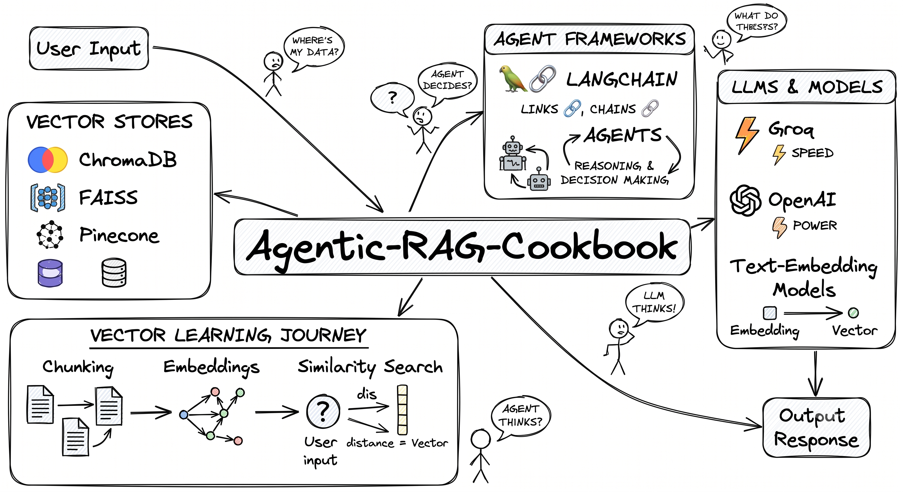

# 🤖 Agentic RAG Cookbook

Welcome to the **Agentic RAG Cookbook**! This repository is a comprehensive, step-by-step educational guide and production-ready laboratory for building state-of-the-art **Retrieval-Augmented Generation (RAG)** systems, conversational chatbots, and stateful multi-agent workflows. 

Going far beyond simple query-and-fetch pipelines, this cookbook provides a structural, numbered learning progression that leads you from the mathematical fundamentals of text embeddings all the way to advanced multi-agent orchestrations, cognitive architectures, guardrails, and programmatic evaluations using **LangChain** and **LangGraph**.

<p align="center">
  
</p>

---

## 🏗️ Project Overview

The repository acts as a conceptual pipeline, systematically introducing and layering complex AI engineering concepts:
1. **Basics of Text Ingestion & Embeddings**: Creating and processing local documents; comparing embedding vectors using cosine distance.
2. **Vector Stores & Database Connectors**: Setting up and query-indexing across diverse database backends, including **ChromaDB**, **FAISS**, **Neo4j GraphDB**, **AstraDB**, **Pinecone**, and ephemeral in-memory indexing.
3. **Advanced Retrieval Strategies**: Fine-tuning context relevance via hybrid dense-sparse search, cross-encoder reranking, Maximal Marginal Relevance (MMR), query expansion, query decomposition, and Hypothetical Document Embeddings (HyDE).
4. **Multimodal Capabilities**: Expanding the RAG paradigm to handle image inputs and chart reasoning using OpenAI's vision APIs.
5. **Agentic Loops & Tool Binding**: Constructing custom reasoning loops, binding standard tools (e.g., weather APIs, math executors, web search) to LLMs, and forcing structured outputs via `TypedDict` and `Pydantic`.
6. **Stateful Graph Workflows**: Building state machines with **LangGraph** to support streaming, intermediate execution state inspection, and manual human-in-the-loop approval gates.
7. **Cognitive Architectures & Corrective RAG**: Implementing industry-standard patterns such as ReAct (Reasoning and Acting), Self-Reflection, Chain-of-Thought (CoT), Corrective RAG (CRAG), and Adaptive Routing RAG.
8. **Multi-Agent Coordination**: Organizing complex work across linear pipelines, supervisor-led agent networks, and nested multi-team hierarchies.
9. **Infrastructure, Production, & Testing**: Securing applications with guardrails, wrapping graphs in API Gateways, implementing caching layers, and running end-to-end evaluations (e.g., faithfulness, relevancy, and Ragas metrics).

---

## 📂 File Inventory

Below is a comprehensive list of all Python files found in this repository, structured by their functional category in the cookbook's learning path.

### 1. Document Ingestion & Embeddings
* **`01a_Create_Text_Files.py`**
  Creates local dummy cybersecurity text files to seed the dataset directory for subsequent retrieval exercises.
* **`01b_Embedding_Check.py`**
  Initializes OpenAI embedding models and calculates cosine similarity to check spatial proximity between sentences.
* **`01c_PublicSources_Data.py`**
  Retrieves and preprocesses unstructured data from public and external web sources for RAG pipeline integration.

### 2. Local & Cloud Vector Databases
* **`02a_ChromaDB_VectorStore.py`**
  Demonstrates how to initialize, configure, and query a local ChromaDB vector store using documents and metadata.
* **`02b_ChromaDB_RAGChain.py`**
  Bridges ChromaDB with a LangChain chat model to build a basic, single-turn question-answering RAG pipeline.
* **`02c_ChromaDB_LCEL_NewDoc.py`**
  Explains how to use LangChain Expression Language (LCEL) to dynamically ingest new documents and execute RAG chains in a unified expression.
* **`02d_ChromaDB_ConverseMemory.py`**
  Integrates session-aware conversational memory with ChromaDB RAG to support multi-turn dialogues with full chat history preservation.
* **`03a_FAISS_BuildStore.py`**
  Builds, populates, and persists a local, high-performance FAISS (Facebook AI Similarity Search) index using OpenAI Embeddings.
* **`03b_FAISS_SimilaritySearch.py`**
  Loads a saved FAISS index and performs direct semantic similarity searches, filtering results by confidence score thresholds.
* **`03c_FAISS_RAG_Groq_Doc.py`**
  Combines FAISS retrieval with the Groq API (e.g., Llama-3 models) to run rapid RAG question-answering on local documents.
* **`03d_FAISS_BuildStore_TextFile.py`**
  A customized utility designed to load raw txt assets, chunk them recursively, and index them into a dedicated FAISS store.
* **`03e_FAISS_RAG_Groq_TextFile.py`**
  Executes a low-latency chat-RAG chain targeting the text-file FAISS database using the Groq LLM client.
* **`04a_Neo4jDB.py`**
  Configures and connects to a Neo4j Graph Database, illustrating entity extraction and basic property graph storage.
* **`04b_Neo4jDB.py`**
  Queries graph connections to showcase GraphRAG, retrieving rich relation contexts that standard vector search misses.
* **`05_InMemory_VectorStore.py`**
  Utilizes simple, ephemeral in-memory indexing configurations for rapid prototyping and mock vector stores without database setup.
* **`06_AstraDB_VectorStore.py`**
  Connects a RAG pipeline to DataStax AstraDB (serverless cloud Cassandra) to index and query vector collections in the cloud.
* **`07_PineconeDB_VectorStore.py`**
  Configures a managed Pinecone cloud database to run high-dimension similarity lookups and hybrid retrieval at scale.

### 3. Advanced Splitting & Chunker Engineering
* **`08a_RAG_CustomChunker.py`**
  Implements custom regex-based and semantic text splitting strategies to retain structural document context during ingestion.
* **`08b_RAG_NativeChunker.py`**
  Demonstrates out-of-the-box LangChain text splitters, comparing recursive character splitting and token-based splitting limits.

### 4. Advanced Search & Query Transformation
* **`09_Dense_Sparse.py`**
  Implements hybrid search by merging dense vector embeddings with sparse BM25 keyword matching scores.
* **`10a_ReRanking.py`**
  Applies cross-encoder re-ranking to a retrieved set of document chunks, pushing the most highly relevant segments to the top.
* **`10b_ReRanking.py`**
  Integrates a third-party Reranker (such as Cohere) directly into a LangChain pipeline, highlighting performance improvements.
* **`11_MMR.py`**
  Uses Maximal Marginal Relevance (MMR) algorithms to retrieve documents, balancing semantic similarity with diverse token viewpoints to eliminate redundancy.
* **`12_QueryExpansion.py`**
  Employs an LLM to expand a single user query into multiple conceptual variations, ensuring broader coverage during vector store retrieval.
* **`13_QueryDecomposition.py`**
  Decomposes multifaceted user questions into simpler, individual sub-queries, executes them in parallel, and synthesizes the answers.
* **`14a_HyDE_Manual_BetterOP.py`**
  Implements manual Hypothetical Document Embeddings (HyDE) where a model-generated mock response acts as the embedding query.
* **`14b_HyDE_Embed_Web.py`**
  Combines HyDE query formulation with live web search APIs to fetch verified, up-to-date context from the internet.
* **`14c_HyDE_Embed_Custom.py`**
  Customizes HyDE template prompts and temperature parameters to adapt the search generator to narrow, specialized domains.

### 5. Multimodal RAG
* **`15a_MultimodalOpenAI.py`**
  Passes mixed image and text payloads to OpenAI's GPT-4o model, showcasing standard visual interpretation.
* **`15b_MultimodalOpenAI.py`**
  Retrieves images from a dataset based on text queries and passes both the query and images to a multimodal generator.
* **`15c_MultimodalOpenAI.py`**
  Implements a complete multimodal RAG flow capable of reading and answering questions about charts, tables, and PDF diagrams.

### 6. Agentic Foundations & Tool Integration
* **`16a_LangchainAgent_Intro.py`**
  Introduces the agentic paradigm, configuring a simple reasoning loop that executes tools based on model outputs.
* **`16b_LangchainAgent_WeatherAPI.py`**
  Builds a functional agent by wrapping a real-time Weather API into a structured tool, enabling the model to pull external data.
* **`16c_Langchain_Models.py`**
  Demonstrates switching and comparing LLM backends (OpenAI, Anthropic, Groq) inside standard LangChain agent structures.
* **`16d_Langchain_StreamVSBatch.py`**
  Compares token streaming and execution batching techniques in LangChain, optimizing latency and network overhead.
* **`16e_Langchain_BindTools.py`**
  Explores low-level tool binding to ChatModels, converting standard Python function signatures into OpenAI-compatible tool schemas.
* **`16f_Langchain_Message.py`**
  Teaches manipulation of message histories using `SystemMessage`, `HumanMessage`, `AIMessage`, and `ToolMessage` formatting.
* **`16g_Langchain_StructuredTypeDict.py`**
  Forces an LLM to generate structured outputs formatted specifically as a native Python `TypedDict`.
* **`16h_Langchain_StructuredPydantic.py`**
  Leverages Pydantic schemas to validate and parse structured model outputs with absolute static and runtime type-safety.

### 7. Stateful LangGraph Orchestration
* **`17_SimpleGraph.py`**
  Acts as a gentle introduction to LangGraph, setting up a basic state machine with manual nodes and direct edges.
* **`18a_Chatbot.py`**
  Implements a state-retaining chatbot using LangGraph, persisting conversation states across user messages.
* **`18b_Streaming.py`**
  Explores deep streaming setups, yielding both graph state changes (node execution traces) and raw LLM tokens to the client in real-time.
* **`18c_Middleware_Tokens.py`**
  Demonstrates custom middleware patterns within LangGraph to monitor, count, and restrict token usage across node executions.
* **`18d_Middleware_HumanInLoop.py`**
  Implements manual approval gates and state edits (Human-In-The-Loop) before letting the graph transition to a critical action node.
* **`19a_TypedDict_StateSchema.py`**
  Configures a LangGraph state schema using a standard Python `TypedDict`, describing state properties and execution tracking.
* **`19b_DataClassStateSchema.py`**
  Uses Python `dataclass` structures as state schemas inside LangGraph, providing clean typing and field instantiations.
* **`19c_Pydantic.py`**
  Details standalone validation mechanics, constraint definitions, and nested field parsing using Pydantic.
* **`19d_Pydantic_StateSchema.py`**
  Configures state graphs using Pydantic schemas, enforcing runtime structural validity for all active states.
* **`20a_Messages_Tools_Baseline.py`**
  Establishes a baseline tool-execution state graph, serving as the benchmark for state reducer optimizations.
* **`20b_State_Graph_Reducers.py`**
  Illustrates state reducers in LangGraph, showing how to define custom merge operations (such as appending list elements) on state updates.
* **`21a_ChatbotsWithMultipletools.py`**
  Builds a multi-tool graph chatbot that can dynamically invoke math computations, system directories, or database searches.
* **`21b_ChatbotsWithMultipletools.py`**
  Adds advanced contextual history and tool result formatting to a multi-tool chatbot flow.
* **`23a_AgentsArch_MathTools.py`**
  Configures a modular graph routing system focused on math solvers, mapping inputs to advanced calculation toolsets.
* **`23b_AgentsArch_SearchTools.py`**
  Creates an agent architecture with integrated web-search tools (such as Tavily) to verify data during execution.
* **`23c_AgentsArch_DictTechTools.py`**
  Maps tools and functions dynamically using dictionary lookups, allowing rapid runtime configuration of agent abilities.
* **`23d_AgentsArch_AllTools.py.py`**
  Integrates diverse tool classes (math, database, and web search) under a unified state coordinator node.

### 8. Cognitive Agent Architectures (CRAG, Adaptive RAG, and CoT)
* **`24_AgenticRAG.py`**
  A modular implementation of Agentic RAG where the LLM decides when to retrieve documents and when to synthesize answers.
* **`25a_ReAct.py`**
  Implements the standard Reasoning and Acting (ReAct) loop from scratch as a cycle of agent calls and tool nodes in LangGraph.
* **`25b_ReAct.py`**
  Extends the custom ReAct agent loop with conversational memory and dynamic session persistence.
* **`25c_AgenticRAG_Grader.py`**
  Integrates a document grader node that verifies whether retrieved contexts are relevant before executing answer generation.
* **`25d_AgenticRAG_CRAG.py`**
  Implements Corrective RAG (CRAG) which grades retrieved documents and falls back to a Wikipedia web search if the local knowledge is insufficient.
* **`26_COTRag.py`**
  Implements Chain-of-Thought (CoT) reasoning in a RAG pipeline, directing the model to output a detailed internal rationale before writing the final response.
* **`27_SelfReflection.py`**
  Enables self-reflection loops inside the graph, forcing the model to critique and rewrite its drafts iteratively until quality criteria are met.
* **`28_QueryPlanDecompose.py`**
  Constructs a query-planner node that decomposes user goals into a step-by-step sequential action plan for execution.
* **`29_AnswerSynthesis.py`**
  Aggregates multiple retrieved documents, web results, and intermediate tool responses into a consolidated, highly coherent final response.

### 9. Multi-Agent Systems
* **`30a_Multiagent_Sequential.py`**
  Sets up a sequential pipeline where separate specialist agents (e.g., Researcher, Writer, Editor) pass their output downstream in order.
* **`30b_Multiagent_Supervisor.py`**
  Builds a hub-and-spoke multi-agent team where a master "Supervisor" LLM evaluates user input and dynamically delegates tasks to subordinate specialist agents.
* **`30c_Multiagent_MultiTeams.py`**
  Implements nested team hierarchies, enabling a super-supervisor agent to manage distinct, coordinate-based multi-agent teams (e.g., dev team vs. QA team).
* **`31_Adaptive_RoutingRAG.py`**
  Implements Adaptive RAG, utilizing a classification node to route queries to web search, vector store, or direct answering depending on the topic.

### 10. Long-term Memory & Caching
* **`32_Chatbot_RAGMemory.py`**
  Combines conversational memory with persistent user profile tracking to build a personalized, long-term memory RAG chatbot.
* **`33_CacheAugmentGeneration.py`**
  Builds a cache layer that intercepts user requests, performing semantic checks to return pre-computed responses for identical prompts and saving API costs.

### 11. Production Security & Gateways
* **`34a_GuardRails.py`**
  Implements input-validation guardrails to intercept, classify, and block toxic inputs, prompt injections, and off-topic requests.
* **`34b_GuardRails.py`**
  Implements output-validation guardrails that scan generated responses for hallucination, correct formatting, and sensitive data leaks (PII).
* **`34c_GuardRails.py`**
  Integrates custom guardrail logic and programmatic verification within intermediate LangGraph node transformations.
* **`35a_Gateway.py`**
  Wraps a compiled LangGraph agent in a RESTful API gateway structure, exposing executable HTTP endpoints.
* **`35b_Gateway.py`**
  Secures the agent gateway by adding rate limiting, CORS configurations, and API key authentication layers.
* **`35c_Gateway.py`**
  Integrates rigorous input-schema validation and comprehensive error-logging middleware into the production gateway server.

### 12. Evaluation & Testing
* **`36a_RagEvaluation.py`**
  Measures RAG performance using custom metrics, testing faithfulness and answer relevance across mock dataset queries.
* **`36b_RagEvaluation.py`**
  Integrates the **Ragas** framework to compute automated, high-fidelity metrics for context recall, precision, and faithfulness.
* **`36c_RagEvaluation.py`**
  Automates test suite executions, registering dataset evaluations to LangSmith to track and version pipeline performance improvements over time.

---

## 🛠️ Specialized Subprojects

### 📂 `38_Complete_RAG_Project`
A standalone, production-ready, modular Agentic RAG application. It reads local PDF files from `data/` and URLs listed in `data/url.txt`, processes them with `RecursiveCharacterTextSplitter`, embeds them using OpenAI `text-embedding-3-small`, and saves them to a local **FAISS** database.
- **Workflow & UI**: Uses LangGraph to orchestrate a ReAct Agent that can dynamically choose between local document retrieval (FAISS) or external web lookups (Wikipedia). It features an interactive **Command-Line Interface (CLI)** and a high-performance **Streamlit Web Application** dashboard.
- **Python Files**:
  - `main.py`: Entry point for running the interactive terminal loop and conducting batch evaluations.
  - `streamlit_app.py`: Beautiful web-app client exposing the RAG chat and pipeline configurations visually.
  - `src/config/config.py`: Central environment and hyperparameters configuration.
  - `src/document_ingestion/document_processor.py`: PDF loader, text chunker, and vector database populate logic.
  - `src/vectorstore/vectorstore.py`: Local FAISS index setup, loading, and retriever-tool wrappers.
  - `src/state/rag_state.py`: Formulates the active LangGraph execution state schema.
  - `src/node/nodes.py` & `src/node/reactnode.py`: State nodes executing retriever lookups and executing ReAct agent tasks.
  - `src/graph_builder/graph_builder.py`: Hooks up the nodes, edges, conditional branches, and compiles the LangGraph state machine.

### 📂 `39_FrontEnd`
An advanced iteration of the production project, transitioning from standard Streamlit to a beautiful, modern **Full-Stack Application** architecture. 
- **Stack**: Includes a high-performance, asynchronous **FastAPI** backend server to serve the LangGraph agent and a fast, modern **React (TypeScript + Vite)** frontend user interface for a fully fledged commercial-grade experience.
- **Python Files**:
  - `main.py` & `streamlit_app.py`: Retained terminal entry points and fallback Streamlit dashboards.
  - `api/app.py`: FastAPI application script defining CORS policies, request/response models, and stream-ready API endpoints (`/chat`, `/ingest`) to feed the React frontend.
  - `src/` modules: Reuses the modular document ingestion, FAISS management, LangGraph ReAct configurations, and node builder logic from project 38 to handle the core pipeline execution behind the web API.

---

## 🔍 Debugging Module (`22_Debugging`)

The **`22_Debugging`** directory is a dedicated sandbox designed to master local and cloud-based debugging, execution tracing, and state-inspection of LangGraph applications using **LangSmith** and **LangGraph Studio / API**.

### 📁 Directory Structure
```
22_Debugging/
├── Debugging_OpenAI.py   # Core script defining the compiled agent and its tools
├── langgraph.json        # Configuration file for the LangGraph Local Server API
├── pyproject.toml        # Standalone package specifications and dependencies
└── run_it.sh             # Executable bash shell script to start the server CLI
```

### 🎯 Purpose and Observability Capabilities
In complex agentic graphs, understanding *why* an agent made a decision, *which* tools it invoked, and *what* state variables were updated is incredibly difficult. This module demonstrates how to configure:
1. **Full Observability Tracing**: Linking your local environment directly to LangSmith to see raw prompts, LLM reasoning steps, latency profiles, and token counts.
2. **Local Graph Servers**: Setting up local API endpoints that mimic production cloud runtimes.
3. **Visual Inspections**: Allowing developers to visually interact with and "Time Travel" through graph execution states in real-time.

### ⚙️ Code Logic Summary (`Debugging_OpenAI.py`)

The file defines a fully operational, tool-calling agent using LangGraph's core patterns:

1. **State Definition**:
   Uses a state dictionary conforming to `TypedDict`:
   ```python
   class State(TypedDict):
       messages: Annotated[list[BaseMessage], add_messages]
   ```
   The `add_messages` annotation acts as a **state reducer**, ensuring that new messages generated during conversations are appended to the chat history list rather than overwriting it.

2. **Model & Tool Setup**:
   - Explicitly instantiates `ChatOpenAI(model="gpt-4o-mini", temperature=0)`.
   - Defines a custom arithmetic tool `add(a, b)` using the `@tool` decorator.
   - Binds the tool definition to the chat model using `model.bind_tools([add])` so the LLM knows the tool exists and understands its input parameter schema.
   - Configures a prebuilt `ToolNode([add])`, which acts as an automated executor whenever the model requests a tool call.

3. **Graph Node Workflow**:
   - **`call_model` Node**: Passes the current chat history/state to the tool-aware model, capturing its response.
   - **`tools` Node (`ToolNode`)**: Executes the math tool and appends the result back to the graph state.
   - **`should_continue` Router**: A conditional edge function that inspects the latest message. If the model included `tool_calls` in its payload, it routes execution to the `"tools"` node; otherwise, it routes to `END`.

4. **Graph Construction & Compilation**:
   ```python
   graph_workflow = StateGraph(State)
   graph_workflow.add_node("agent", call_model)
   graph_workflow.add_node("tools", tool_node)
   
   graph_workflow.add_edge(START, "agent")
   graph_workflow.add_edge("tools", "agent")  # Dynamic return-to-reasoning edge
   graph_workflow.add_conditional_edges("agent", should_continue, {"tools": "tools", END: END})
   
   agent = graph_workflow.compile()
   ```

5. **Server Configurations (`langgraph.json` & `pyproject.toml`)**:
   - **`pyproject.toml`**: Specifies that the environment requires `langgraph-api>=0.11.2` and `langchain-openai`.
   - **`langgraph.json`**: Acts as the project declaration for the LangGraph CLI. It links the graph name `openai_agent` to the python variable `agent` inside the script (`./Debugging_OpenAI.py:agent`).
   - **`run_it.sh`**: Running `./run_it.sh` starts a local dev-server instance by executing `uv run python -m langgraph_api.cli`. This binds the compiled agent to local address `http://127.0.0.1:2024`, enabling state debugging, endpoint API querying, and visualization.

---

## 🚀 Setup and Quickstart

This workspace utilizes [**`uv`**](https://github.com/astral-sh/uv), an extremely fast Python package installer and manager.

### 1. Prerequisites
Ensure you have Python 3.12+ and `uv` installed. If you need `uv`, install it via:
```bash
# macOS/Linux
curl -LsSf https://astral-sh/uv/install.sh | sh
```

### 2. Install Dependencies
Run the following command in the root folder to set up a virtual environment and synchronize all required libraries:
```bash
uv sync
```

### 3. Environment Variables
Copy the sample environment file and insert your API credentials (OpenAI, Groq, LangSmith, AstraDB, etc.):
```bash
cp dot_env_sample.txt .env
```
Ensure your `.env` contains:
```env
OPENAI_API_KEY=your-openai-api-key
GROQ_API_KEY=your-groq-api-key
LANGCHAIN_TRACING_V2=true
LANGCHAIN_API_KEY=your-langsmith-api-key
```

### 4. Running a Cookbook Chapter
Execute any script file directly using `uv run`. For example, to run the basic FAISS build check:
```bash
uv run 03a_FAISS_BuildStore.py
```
To spin up the local LangGraph API debugging server inside `22_Debugging`:
```bash
cd 22_Debugging
chmod +x run_it.sh
./run_it.sh
```
